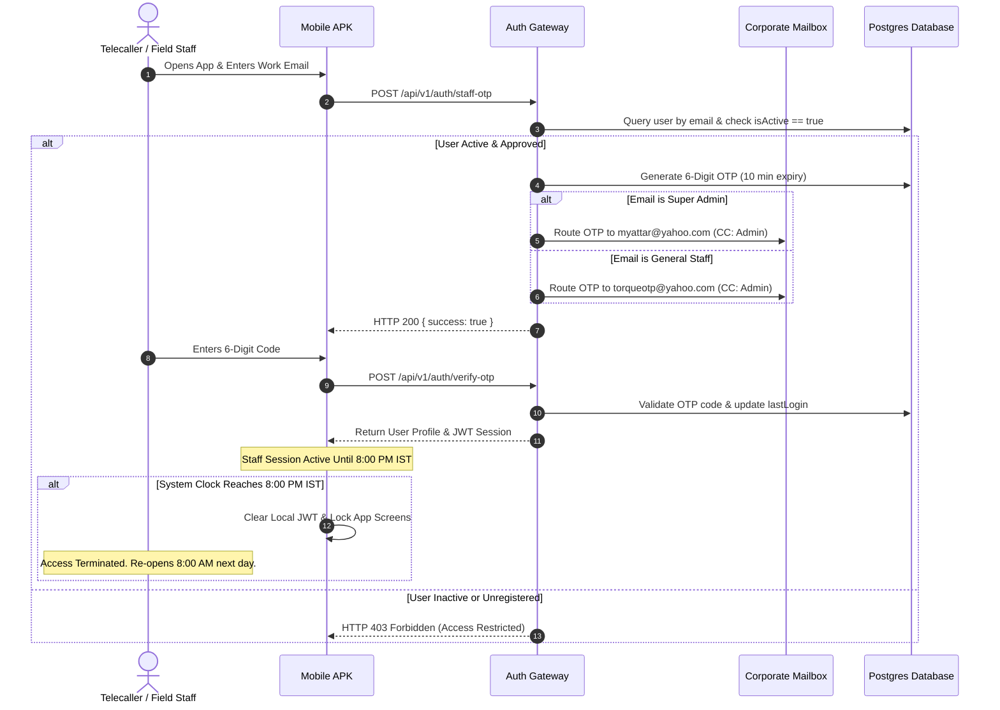
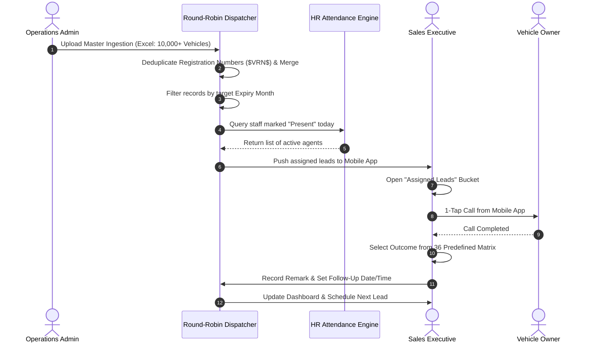
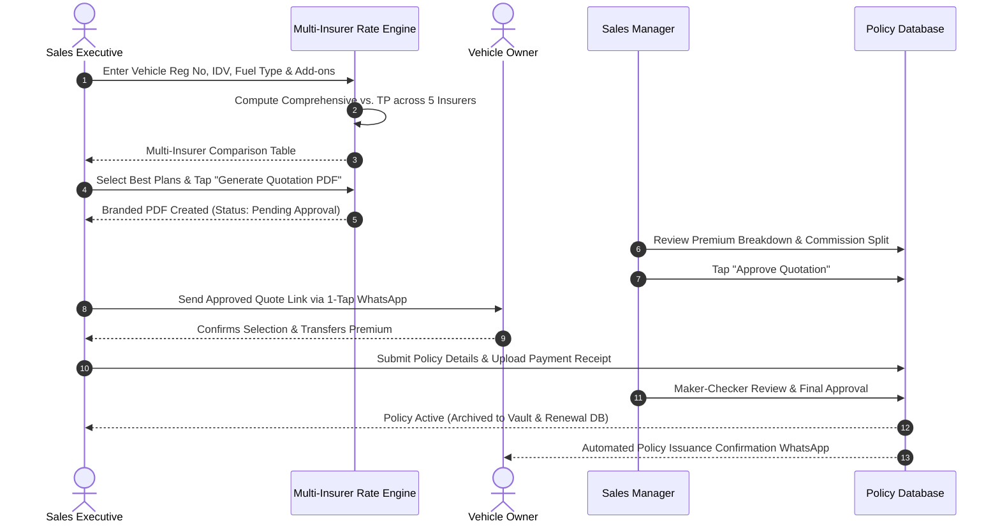
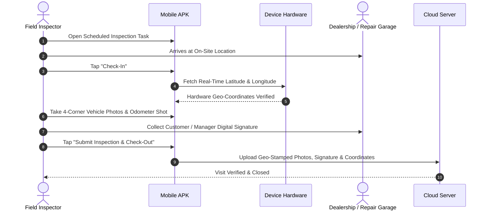
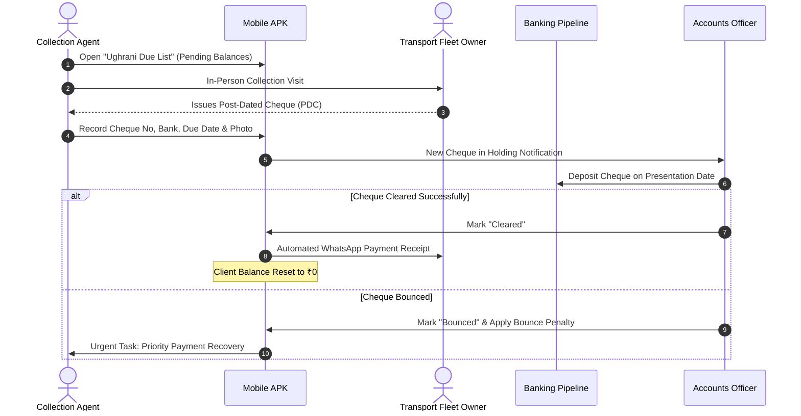
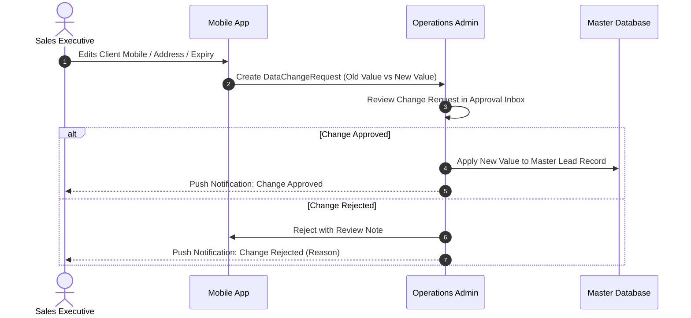
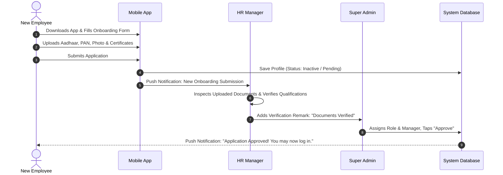
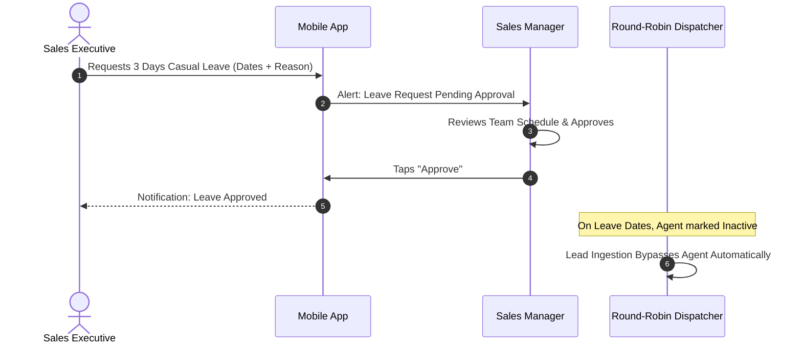
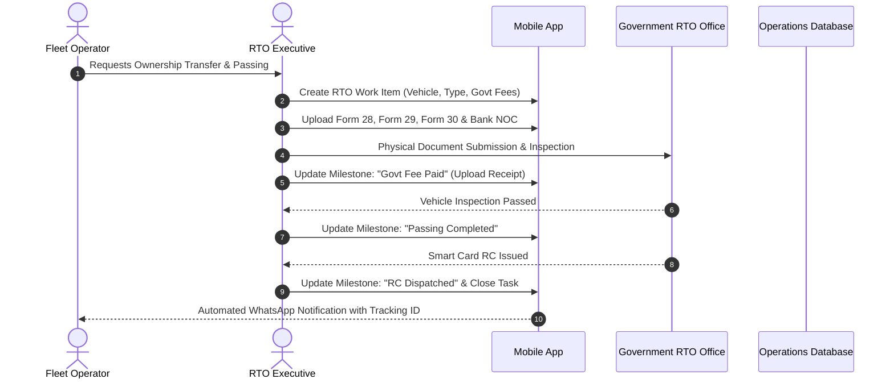

# TORQUE AUTO ADVISOR — MASTER ENTERPRISE SPECIFICATION, COMPLETE FEATURE CATALOG & ROLE-WISE USER FLOWS

> **Document Classification**: Master Product Specification, Architecture Blueprint & Operational Standard Operating Procedure (SOP)  
> **Platform Ecosystem**: Native Cross-Platform Mobile Application (Android/iOS Expo) + Next.js Web Operations Control Center + Enterprise PHP/PostgreSQL Core  
> **Target Audience**: Business Stakeholders, Automotive Dealership Networks, Insurance Brokers, Fleet Operators, System Architects, Operations Teams  
> **Version**: 3.0 (Master Enterprise Edition)  
> **Last Updated**: September 2026  

---

## Table of Contents
1. [Executive Summary & Value Proposition](#1-executive-summary--value-proposition)
2. [Core Business Problems Solved & Quantified ROI](#2-core-business-problems-solved--quantified-roi)
3. [Exhaustive Feature Catalog by Functional Module](#3-exhaustive-feature-catalog-by-functional-module)
   - [Module 1: Enterprise Security, Shift Access & Multi-Tier OTP Routing](#module-1-enterprise-security-shift-access--multi-tier-otp-routing)
   - [Module 2: Master Ingestion, Expiry Buckets & Leave-Aware Round-Robin](#module-2-master-ingestion-expiry-buckets--leave-aware-round-robin)
   - [Module 3: Standardized 36-Outcome Disposition Matrix & Auto-Follow-ups](#module-3-standardized-36-outcome-disposition-matrix--auto-follow-ups)
   - [Module 4: Multi-Insurer Rate Calculator & Instant Branded PDF Quoting](#module-4-multi-insurer-rate-calculator--instant-branded-pdf-quoting)
   - [Module 5: Policy Operations, Digital Vault & Maker-Checker Approvals](#module-5-policy-operations-digital-vault--maker-checker-approvals)
   - [Module 6: Dedicated Year-on-Year Renewal Management Pipeline](#module-6-dedicated-year-on-year-renewal-management-pipeline)
   - [Module 7: Commercial Vehicle Fitness & Inspection Operations](#module-7-commercial-vehicle-fitness--inspection-operations)
   - [Module 8: Government RTO Paperwork & Milestone Tracking](#module-8-government-rto-paperwork--milestone-tracking)
   - [Module 9: Motor Insurance Claims Intimation & Settlement Tracker](#module-9-motor-insurance-claims-intimation--settlement-tracker)
   - [Module 10: Vehicle Loans, Used Car Finance & Refinance Pipeline](#module-10-vehicle-loans-used-car-finance--refinance-pipeline)
   - [Module 11: "Ughrani" Debt Recovery, Credit Management & Cheque Vault](#module-11-ughrani-debt-recovery-credit-management--cheque-vault)
   - [Module 12: Omnichannel Field Visit & GPS Geofenced Check-In Engine](#module-12-omnichannel-field-visit--gps-geofenced-check-in-engine)
   - [Module 13: HR, Biometric/Selfie Attendance, Leaves & Payroll](#module-13-hr-biometricselfie-attendance-leaves--payroll)
   - [Module 14: Real-Time Executive BI, Owner Command Center & KPI Heatmaps](#module-14-real-time-executive-bi-owner-command-center--kpi-heatmaps)
4. [Onboarding & Authentication Journeys](#4-onboarding--authentication-journeys)
   - [Path A: Admin Creates Account (Instant Access)](#path-a-admin-creates-account-instant-access)
   - [Path B: Manager Adds Executive (Pending Admin Activation)](#path-b-manager-adds-executive-pending-admin-activation)
   - [Path C: Employee Self-Registration & Document Verification Form](#path-c-employee-self-registration--document-verification-form)
   - [First Login Experience (Biometrics, PIN, Push Notifications)](#first-login-experience-biometrics-pin-push-notifications)
5. [Role-Wise User Flows & Detailed Daily Operations](#5-role-wise-user-flows--detailed-daily-operations)
   - [Role 1: Super Admin / Business Owner Detailed Daily Flow](#role-1-super-admin--business-owner-detailed-daily-flow)
   - [Role 2: Operations Admin Detailed Daily Flow](#role-2-operations-admin-detailed-daily-flow)
   - [Role 3: Sales Manager Detailed Daily Flow](#role-3-sales-manager-detailed-daily-flow)
   - [Role 4: Sales Executive (Telecaller) Detailed Daily Flow](#role-4-sales-executive-telecaller-detailed-daily-flow)
   - [Role 5: Dedicated Renewal Executive Detailed Daily Flow](#role-5-dedicated-renewal-executive-detailed-daily-flow)
   - [Role 6: Field Agent & Inspection Inspector Detailed Daily Flow](#role-6-field-agent--inspection-inspector-detailed-daily-flow)
   - [Role 7: HR Manager Detailed Daily Flow](#role-7-hr-manager-detailed-daily-flow)
   - [Role 8: Accountant & Finance Officer Detailed Daily Flow](#role-8-accountant--finance-officer-detailed-daily-flow)
   - [Role 9: Stakeholder & Read-Only Viewer Flow](#role-9-stakeholder--read-only-viewer-flow)
6. [Cross-Role Interactive Lifecycle Flows (With Visual Sequence Diagrams)](#6-cross-role-interactive-lifecycle-flows-with-visual-sequence-diagrams)
   - [Flow 1: Secure Mobile Auth & 8:00 PM Shift Cutoff Lifecycle](#flow-1-secure-mobile-auth--800-pm-shift-cutoff-lifecycle)
   - [Flow 2: Automated Lead Assignment & Telecalling Lifecycle](#flow-2-automated-lead-assignment--telecalling-lifecycle)
   - [Flow 3: Rate Comparison, Dual Approval & Policy Issuance](#flow-3-rate-comparison-dual-approval--policy-issuance)
   - [Flow 4: Geo-Verified Field Inspection & Customer Visit](#flow-4-geo-verified-field-inspection--customer-visit)
   - [Flow 5: "Ughrani" Debt Recovery, Cheque Presentation & Bounce Lifecycle](#flow-5-ughrani-debt-recovery-cheque-presentation--bounce-lifecycle)
   - [Flow 6: Data Protection & Maker-Checker Change Request Flow](#flow-6-data-protection--maker-checker-change-request-flow)
   - [Flow 7: Employee Onboarding & Multi-Tier Verification Journey](#flow-7-employee-onboarding--multi-tier-verification-journey)
   - [Flow 8: Leave Request & Automated Exclusion from Lead Dispatch](#flow-8-leave-request--automated-exclusion-from-lead-dispatch)
   - [Flow 9: Commercial Vehicle RTO & Fitness Processing Lifecycle](#flow-9-commercial-vehicle-rto--fitness-processing-lifecycle)
7. [Comprehensive Role-Based Access Control (RBAC) Matrix](#7-comprehensive-role-based-access-control-rbac-matrix)
8. [Client Pitch Strategy, ROI Metrics & Owner Daily Success KPIs](#8-client-pitch-strategy-roi-metrics--owner-daily-success-kpis)

---

## 1. Executive Summary & Value Proposition

**Torque Auto Advisor** is a unified, enterprise-grade Automotive Insurance, Vehicle Finance, Fleet Compliance, and RTO Operations Management Platform. It replaces disjointed spreadsheets, paper diaries, manual WhatsApp chats, and disconnected desktop software with a secure, centralized digital operating system.

The platform bridges frontline telecallers and field inspectors on native mobile apps directly with back-office underwriters, claims managers, accountants, HR personnel, and executive leadership in real time.

```
                                  TORQUE PLATFORM ARCHITECTURE
 ┌────────────────────────────────────────────────────────────────────────────────────────┐
 │                                   SUPER ADMIN PORTAL                                   │
 │       Master Import • Shift Config • Dual Approvals • Financials • Executive BI        │
 └───────────────────────────────────────────┬────────────────────────────────────────────┘
                                             │
                       ┌─────────────────────┴─────────────────────┐
                       ▼                                           ▼
       ┌───────────────────────────────┐           ┌───────────────────────────────┐
       │     MOBILE FIELD WORKFORCE    │           │    TELECALLING & OPERATIONS   │
       │ GPS Visits • Camera Upload    │           │ Lead Calling • Rate Quotes    │
       │ Inspections • Client Sign-off │           │ Policy Issuance • Renewals    │
       └───────────────┬───────────────┘           └───────────────┬───────────────┘
                       │                                           │
                       └─────────────────────┬─────────────────────┘
                                             ▼
 ┌────────────────────────────────────────────────────────────────────────────────────────┐
 │                                 POST-ISSUANCE SERVICES                                 │
 │           Claims Intimation • RTO Transfers • Fitness Certificates • Ughrani           │
 └────────────────────────────────────────────────────────────────────────────────────────┘
```

---

## 2. Core Business Problems Solved & Quantified ROI

| # | Traditional Industry Bottleneck | How Torque Auto Advisor Solves It | Business Impact / Quantified ROI |
|---|---|---|---|
| **1** | **The Spreadsheet Nightmare**<br>Managing 25,000+ vehicle records across shared Excel sheets leads to lost leads, accidental file overwrites, and zero audit accountability. | Automated master ingestion engine with vehicle registration number ($VRN$) deduplication, automated filtering by expiry month, and instant distribution. | **100% elimination of lost data**; instant access to any vehicle record in < 1 second. |
| **2** | **Client Data Theft & Leakage**<br>Field agents and telecallers download spreadsheets or save client contacts to personal phones, leaving with valuable renewal books when resigning. | Zero raw file downloads on mobile; centralized data access; automatic daily **8:00 PM IST shift cutoff**; passwordless single-inbox OTP authorization. | **Zero customer data theft**; company-owned proprietary database remains secure. |
| **3** | **Inefficient Lead Assignment & Agent Idle Time**<br>Manually dividing leads each morning wastes 2-3 hours and assigns leads to executives who are absent or on leave. | Intelligent **Leave-Aware Round-Robin Dispatcher** that automatically checks HR attendance and distributes leads evenly across active agents. | **Saves 3 hours daily** of managerial time; 0% leads assigned to absent staff. |
| **4** | **Policy Renewal Leakage to Competitors**<br>Vehicle insurance expires on fixed dates. Missing an expiry window by even 24 hours means the customer renews elsewhere. | Automated 60-day, 30-day, 15-day, and 7-day renewal pipelines with built-in follow-up triggers and 1-tap WhatsApp reminder broadcasts. | **+35% increase in renewal retention rate**; proactive outreach before competition calls. |
| **5** | **Delayed Quotations & Lost Deals**<br>Agents spend 30-45 minutes manually calculating premiums across multiple insurers, causing customers to shop around. | Integrated **Automated Rate Calculator & Multi-Insurer Studio** that produces side-by-side branded PDF quote comparisons in under 60 seconds. | **Quotation turnaround cut from 45 min to 1 min**; higher conversion velocity. |
| **6** | **Uncollected Cash & Bounced Cheques ("Ughrani" Leakage)**<br>Policies are often issued on credit or against post-dated cheques. Uncollected balances fall through the cracks. | Dedicated **"Ughrani" Recovery Engine & Cheque Management** pipeline with real-time deposit/clearance alerts and debtor age analysis. | **90% reduction in bad debt** and zero uncollected cheque leakage. |
| **7** | **Zero Field Inspection Accountability**<br>Management has no verifiable proof of whether field executives actually visited vehicle dealerships or accident repair yards. | **GPS-Geofenced Field Visit Tracking** capturing exact latitude, longitude, timestamped photographs, and digital customer signature. | **100% verified field visits**; eliminates fraudulent mileage claims. |
| **8** | **Siloed Back-Office Services**<br>RTO fitness certifications, vehicle hypothecation endorsements, claims intimation, and loan paperwork handled in silos. | Unified multi-service lifecycle tying RTO, Commercial Fitness, Claims, and Finance directly to the same vehicle identity profile. | Single source of truth across all automotive lifecycle services. |

---

## 3. Exhaustive Feature Catalog by Functional Module

### Module 1: Enterprise Security, Shift Access & Multi-Tier OTP Routing
* **Passwordless OTP-Only Login**: Prevents credential sharing and credential brute forcing. Every staff member enters their registered corporate email to receive a secure, time-sensitive 6-digit OTP code valid for 10 minutes.
* **Separated Admin vs. Staff OTP Routing**:
  * Staff OTPs route to a centralized administrative monitoring inbox (`torqueotp@yahoo.com`) for controlled employee onboarding and supervised access.
  * Super Admin OTPs route exclusively to the executive mailbox (`myattar@yahoo.com`) with instant CC to management.
* **Daily Shift Auto-Cutoff (8:00 PM IST)**:
  * At exactly 8:00 PM IST daily, all staff sessions automatically terminate.
  * Mobile app access is locked until the following morning.
  * Prevents off-hours client poaching, unauthorized data copying, or unmonitored communication.
* **Super Admin Exemption**: Executive accounts maintain 24/7 unhindered access for emergency approvals and operational supervision.
* **Biometric & PIN Quick Lock**: Mobile app supports optional 4-digit PIN, fingerprint, and FaceID authentication during the active working shift.

### Module 2: Master Ingestion, Expiry Buckets & Leave-Aware Round-Robin
* **Multi-Format Excel & CSV Ingestion Engine**: Ingests 10,000+ vehicle records in seconds with automatic schema mapping (Client Name, Phone, Vehicle Number, Expiry Date, Registration Date, GVW, Address, Message Template, Existing Agent).
* **Preset Mapping Memory**: Save column mapping presets for frequent insurer files (e.g., ICICI Lombard, Bajaj Allianz, Tata AIG) to skip re-mapping.
* **Smart Deduplication & Merge Engine**: Automatically checks Vehicle Registration Number ($VRN$) + Phone Number. Updates existing records instead of generating duplicate entries.
* **Monthly Expiry Bucket Filtering**: One-click grouping of vehicles by target insurance expiry month and date (e.g., September 1st, 2nd, 3rd pipelines).
* **Leave-Aware Dynamic Round-Robin Engine**:
  * Queries HR Attendance in real time.
  * Automatically detects which executives are marked *Present* today.
  * Bypasses executives on approved Leave or absent.
  * Evenly balances new lead allocations across active executives.

### Module 3: Standardized 36-Outcome Disposition Matrix & Auto-Follow-ups
Frontline executives cannot enter arbitrary notes to dismiss leads. Every call must conclude with an official disposition from the 36 Master Outcomes.

| Code | Original Gujarati Disposition | English Translation / Definition | Category | Auto Follow-up | Follow-up Window |
|:---:|---|---|---|:---:|:---:|
| **1** | પૈસાનો વેંત નથી. | Financial constraints / No funds currently | Follow Up | Yes | 7 Days |
| **2** | ગાડી વેચી નાખી. નવા ઓનરનો કોન્ટેક્ટ નથી થયો. | Vehicle sold; new owner contact pending | Vehicle Inactive | No | — |
| **3** | રોંગ નંબર | Wrong telephone number | Invalid Contact | No | — |
| **4** | બંધ નંબર | Switched off / Invalid telephone line | Invalid Contact | No | — |
| **5** | એજન્ટ નંબર | Contact belongs to another broker/agent | Other | No | — |
| **6** | ફોન લાગે છે પણ રિસિવ નથી કરતા | Ringing but call not answered (RNR) | No Answer | Yes | 1 Day |
| **7** | ગાડી પડતર છે. | Vehicle breakdown / Inoperative | Vehicle Inactive | No | — |
| **8** | મોંઘુ પડ્યું અને ANGEL ના રેટમાં પણ ન માન્યા. | Rate too expensive; rejected Angel rates | Lost to Competitor | No | — |
| **9** | સમયસર કોલ ના કર્યો એટલે બીજા પાસે કરાવી લીધો. | Delayed calling; renewed with competitor | Lost to Competitor | No | — |
| **10** | સમયસર ક્વોટેશન ના આપ્યું એટલે બીજા પાસે કરાવી લીધો | Delayed quote delivery; lost to competitor | Lost to Competitor | No | — |
| **11** | એને જે કંપની માં કરવો હતો એમાં આપણાથી ના થયો | Requested insurer not available with us | Lost to Competitor | No | — |
| **12** | એના એજન્ટ પાસે જ કરાવવો છે એવી જીદ છે. | Customer insists on existing personal broker | Lost to Competitor | No | — |
| **13** | શોરૂમમાં કરાવવો છે / કરાવી લીધો | Renewed directly at dealership / showroom | Lost to Competitor | No | — |
| **14** | આપણા ઉપર વિશ્વાસ ના આવ્યો એટલે ના કરાવ્યો | Customer lacked trust / Skeptical | Lost to Competitor | No | — |
| **15** | વાત જ કરવા તૈયાર નથી. ફોન કાપી નાખે છે. | Refused conversation; disconnected call | Not Interested | No | — |
| **16** | હવે મને ફોન ના કરતા એવું કીધેલ છે. | Explicit DND request; do not call again | Not Interested | No | — |
| **17** | છેલ્લે સુધી હા માં હા કરી પછી બીજે કરાવી લીધો. કારણ ના કીધું | Agreed until final step, then bought elsewhere | Lost to Competitor | No | — |
| **18** | એને સાવ ઓછા માં કરવો હતો એટલે આપણે ના કર્યો | Unrealistic discount demanded; unprofitable | Lost to Competitor | No | — |
| **19** | બાકી માં કરવો હતો એટલે મેળ ના પડ્યો | Demanded policy on credit; refused by us | Lost to Competitor | No | — |
| **20** | ગયા વર્ષે ફક્ત નામ ટ્રાન્સફર માટે વીમો કરાવ્યો હતો | Insured last year only for RTO ownership transfer | Other | No | — |
| **21** | આપણા થી અપસેટ છે એટલે બીજા પાસે કરાવી લીધો | Dissatisfied with past service; went elsewhere | Lost to Competitor | No | — |
| **22** | પહેલી વાર કોલ કર્યો ત્યારે જ એમ કીધું કે વીમો ભરાઈ ગયો છે | Already renewed prior to our first call | Lost to Competitor | No | — |
| **23** | હજી ફોલોઅપ ચાલુ છે. કરાવે એવા ચાન્સ છે. | Active negotiation; high probability to close | Follow Up | Yes | 3 Days |
| **24** | ચોખી ના જ પાડે છે વીમો ભરવો નથી | Refuses to purchase insurance entirely | Not Interested | No | — |
| **25** | એને ઘરનો કોડ છે | Customer or relative holds own agency code | Lost to Competitor | No | — |
| **26** | RENEWAL લીસ્ટ મા છે | Present in dedicated renewal pipeline | Existing Pipeline | Yes | 5 Days |
| **27** | SCHOOL BUS છે | Vehicle category: School bus (special passing) | Other | No | — |
| **28** | TAKEN LIST મા છે | Present in corporate Taken List | Existing Pipeline | Yes | 5 Days |
| **29** | મોરબી જિલ્લા બહારની ગાડી છે એટલે વિશ્વાસ ન આવ્યો | Out-of-district vehicle; local trust barrier | Lost to Competitor | No | — |
| **30** | TORQUE માં બીજા સ્ટાફ પાસે કરાવ્યો | Renewed internally with another Torque executive | Existing Pipeline | No | — |
| **31** | લોન / હપ્તા ન ભરવાને કારણે ફાઈનાન્સ વાળા ગાડી લઇ ગયા. | Vehicle repossessed by financier for default | Vehicle Inactive | No | — |
| **32** | ગાડી સ્ક્રેપમાં આપી દીધી / રજીસ્ટ્રેશન નંબર કેન્સલ થઇ ગયા. | Vehicle scrapped; registration cancelled | Vehicle Inactive | No | — |
| **33** | વીમા ની expiry date અલગ છે. Exp Date:_________ | Expiry date mismatch in records; updated | Rescheduled | Yes | 14 Days |
| **34** | કોલ બેક / રસ ધરાવે છે (Callback Requested) | Customer requested callback at specified time | Follow Up | Yes | 2 Days |
| **35** | પોલિસી ઈશ્યુ થઈ ગઈ / સફળ (Policy Issued / Won) | Policy successfully closed and payment received | Closed Won | No | — |
| **36** | વીમો કરાવવા રસ નથી (Closed Lost) | Customer not interested in renewing | Closed Lost | No | — |

### Module 4: Multi-Insurer Rate Calculator & Instant Branded PDF Quoting
* **Multi-Segment Rate Engine**: Computes premium across Private Cars, Two-Wheelers, Commercial Goods Vehicles (GCV), Passenger Carrying Vehicles (PCV), and School Buses.
* **Comprehensive Parameter Modeling**: Evaluates Insured Declared Value (IDV), Zero Depreciation, Engine Protect, Return to Invoice (RTI), Consumables, Tyre Secure, Roadside Assistance, and Third-Party (TP) liabilities.
* **Side-by-Side Comparison Studio**: Generates comparison matrices comparing premiums, coverage, and add-ons across top insurers (Bajaj Allianz, ICICI Lombard, Tata AIG, HDFC ERGO, Go Digit, etc.).
* **1-Tap Branded PDF Generator**: Generates professional PDF quotes featuring agency logo, contact info, breakdown of taxes/discounts, and payment bank account/UPI QR codes.
* **Instant WhatsApp Link Sharing**: Automatically generates secure public viewer links (`https://torque.in/view-quote/xyz`) that customers open on mobile without requiring any app installation.

### Module 5: Policy Operations, Digital Vault & Maker-Checker Approvals
* **Searchable Digital Policy Vault**: Instantly filter policies by Policy Number, Registration Number, Chassis Number, Customer Name, or Expiry Date.
* **Maker-Checker Dual Approval Governance**:
  * Frontline agents can draft quotations or submit policy details, but cannot finalize issuance without manager/admin approval.
  * Prevents erroneous discounting, unauthorized commissions, or misstated vehicle details.
* **Document Scanner & Attachment Repository**: Upload RC Book, previous year policy copy, Aadhaar card, PAN card, and vehicle inspection photos directly from the mobile camera.
* **Automated Expiry Countdown**: Real-time visual alerts (Red: <7 days, Amber: <15 days, Green: <30 days).

### Module 6: Dedicated Year-on-Year Renewal Management Pipeline
* **Dedicated Renewal Executive Allocation**: High-value existing customer renewal books (e.g., 400 renewal policies per month) are assigned to dedicated renewal specialists (e.g., 200 leads each) separate from cold telecallers.
* **Automated Renewal Data Creation**: When any policy is issued in the system, Torque automatically schedules a renewal opportunity exactly 11 months later.
* **Historical Policy Linking**: Executives access previous year's NCB, claim history, and policy copy with a single tap, eliminating manual records retrieval.

### Module 7: Commercial Vehicle Fitness & Inspection Operations
* **Government Fitness Workflow**: Step-by-step pipeline for commercial transport passing (speed governor inspection, reflective tape verification, brake test, emission certificate).
* **Challan & Tax Clearance Tracker**: Verifies and logs pending government e-challans and road taxes prior to RTO inspection submission.
* **Fleet Expiry Broadcasting**: Sends automated bulk WhatsApp/SMS renewal alerts to fleet owners 30 days prior to fitness certificate expiry.

### Module 8: Government RTO Paperwork & Milestone Tracking
* **Comprehensive RTO Service Catalog**: Handles Ownership Transfer, Hypothecation Addition (HP Endorsement), Hypothecation Removal (HP Termination), Address Change, Duplicate RC, and State NOC.
* **Mandatory Checklist Enforcer**: Blocks submission of incomplete files by requiring mandatory uploads of Form 28, Form 29, Form 30, Form 34, Form 35, and Bank NOC.
* **Milestone Progress Tracker**:
  $$\text{Documents Collected} \longrightarrow \text{RTO Verification} \longrightarrow \text{Govt Fee Paid} \longrightarrow \text{Passing Inspection} \longrightarrow \text{Smart Card RC Dispatched}$$

### Module 9: Motor Insurance Claims Intimation & Settlement Tracker
* **Accident Incident Logging**: Captures incident date, time, location, accident description, 4-corner damage photos, FIR/Panchnama copies, and driver license details from mobile.
* **Surveyor & Workshop Coordination**: Tracks assigned insurance surveyor name, contact number, inspection date, allocated workshop, and initial loss estimate.
* **Settlement Reconciliation**: Tracks Claim Intimated Amount vs. Approved Amount vs. Customer Deductibles, recording final payment recovery in financial ledgers.

### Module 10: Vehicle Loans, Used Car Finance & Refinance Pipeline
* **Multi-Category Loan Pipeline**: Tracks New Vehicle Loans, Used Car Purchase Loans, and Refinance / Top-Up inquiries.
* **Banking & NBFC Partner Tracking**: Compares sanction terms, interest rates, loan-to-value (LTV) percentages, and processing fees across partnered lending institutions.
* **Disbursement Status Tracker**:
  $$\text{File Login} \longrightarrow \text{Field Investigation (FI)} \longrightarrow \text{Credit Approval} \longrightarrow \text{Sanction Letter} \longrightarrow \text{Disbursement}$$

### Module 11: "Ughrani" Debt Recovery, Credit Management & Cheque Vault
* **Credit Collection Dashboard**: Dedicated tracking for policies issued on credit or post-dated cheques to dealerships and transport fleet owners.
* **Post-Dated Cheque (PDC) Vault**: Tracks Cheque Number, Issuing Bank, Account Name, Cheque Date, Amount, Physical Location, and Presentation Due Date.
* **Cheque Clearance & Bounce Workflow**:
  * Deposit alerts prior to presentation date.
  * Marked as *Cleared* updates customer ledger balance to ₹0 and issues WhatsApp receipt.
  * Marked as *Bounced* applies bounce charges and immediately creates a high-priority recovery task for field collection.

### Module 12: Omnichannel Field Visit & GPS Geofenced Check-In Engine
* **GPS Verified Check-In / Check-Out**:
  * Inspector arrives at dealership or accident garage and taps "Check-In".
  * Hardware GPS records exact latitude, longitude, and timestamp.
  * On departure, taps "Check-Out" to compute time spent and transit distance.
* **Digital Customer Signature**: Collects customer or garage manager signature directly on the phone touchscreen.
* **1-Tap Direct WhatsApp & Dialing**: Initiates phone calls via native dialer and opens pre-formatted WhatsApp templates without saving customer contacts to personal address books.

### Module 13: HR, Biometric/Selfie Attendance, Leaves & Payroll
* **Geofenced Daily Attendance**: Mobile check-in/out with location verification and mandatory selfie validation.
* **Leave Management**: Casual, Sick, and Earned leave applications with manager approval workflows.
* **Round-Robin Lead Integration**: Automatically pauses lead dispatch to employees on approved leave.
* **Automated Payroll & Salary Processing**: Computes base salary, attendance penalties, and sales commission incentives per closed policy.

### Module 14: Real-Time Executive BI, Owner Command Center & KPI Heatmaps
* **Owner Command Center**: Live KPIs for Gross Written Premium (GWP), Conversion Ratios, Total Active Policies, Pending Renewals, and Uncollected Revenue.
* **Manager Team Heatmaps**: Compares executive call volume, visit counts, and conversion velocities.
* **One-Click Export**: Full Excel and PDF report exports for board presentations and audit compliance.

---

## 4. Onboarding & Authentication Journeys

There are three distinct onboarding pathways into the Torque Auto Advisor platform:

```
                            ONBOARDING PATHWAYS
 ┌─────────────────────────────────────────────────────────────────────────────┐
 │ PATH A: Admin Direct Creation (Instant Access)                              │
 │ Admin Enters Name, Email, Role -> Account Activated Instantly               │
 └─────────────────────────────────────────────────────────────────────────────┘
 ┌─────────────────────────────────────────────────────────────────────────────┐
 │ PATH B: Manager Adds Executive (Restricted Access)                          │
 │ Manager Enters Details -> Role Forced to "Executive" -> Requires Admin OK   │
 └─────────────────────────────────────────────────────────────────────────────┘
 ┌─────────────────────────────────────────────────────────────────────────────┐
 │ PATH C: Employee Self-Registration (Comprehensive Document Flow)            │
 │ App Download -> Uploads Aadhaar, PAN, Photo -> HR & Admin Review -> Active   │
 └─────────────────────────────────────────────────────────────────────────────┘
```

### Path A: Admin Creates Account (Instant Access)
1. Super Admin logs into the Torque web portal or mobile app.
2. Navigates to **Management $\rightarrow$ Users** and clicks **Add User**.
3. Enters Full Name, Corporate Email, Temporary Password, and selects Role from the dropdown.
4. Optionally assigns the Executive to a specific Manager's team and configures granular permissions.
5. Clicks **Submit**. The backend creates the account, marks email as verified, and activates the profile immediately.

### Path B: Manager Adds Executive (Pending Admin Activation)
1. Manager logs into the app, navigates to **Users**, and clicks **Add User**.
2. Fills in candidate's Full Name, Email, and Temporary Password.
3. System automatically enforces safety restrictions:
   * **Role**: Restricted strictly to "Sales Executive".
   * **Reporting Manager**: Automatically assigned to the creating Manager.
   * **Account Status**: Created in **Inactive** state.
4. Admin receives a real-time push notification: *"New Executive created by Manager [Name] awaiting activation."*
5. Admin verifies the addition and clicks **Activate**.

### Path C: Employee Self-Registration & Document Verification Form
1. New hire downloads the Torque mobile application.
2. Taps **Join as Employee / Register**.
3. Completes the comprehensive onboarding application:
   * **Personal Information**: Full Name, Email, Password, Date of Birth.
   * **Background Details**: Educational Qualification, Planned Joining Date.
   * **Contact Information**: Personal Mobile, Alternate / Home Mobile Number.
   * **Mandatory Document Uploads**: Aadhaar Card front/back, PAN Card, Passport-size Photograph, Educational Certificates.
4. Taps **Submit**. Account is placed in **Pending Verification** state.
5. Both HR Manager and Super Admin receive a notification with direct links to view and download all uploaded files.
6. HR Manager reviews credentials, adds remarks (e.g., *"Documents verified"*), and Admin clicks **Approve**, assigning role and team.

### First Login Experience (Biometrics, PIN, Push Notifications)
* **First Launch**: Employee enters registered email and receives 6-digit OTP code (routed via `torqueotp@yahoo.com`).
* **Security Setup**: App prompts the user to configure a quick 4-digit PIN lock and enable biometric authentication (Fingerprint / FaceID).
* **Push Token Registration**: Device hardware registers for FCM/APNS push notifications.
* **Role Landing**: Lands on personalized dashboard matching assigned permissions.

---

## 5. Role-Wise User Flows & Detailed Daily Operations

### Role 1: Super Admin / Business Owner Detailed Daily Flow
* **8:30 AM — Command Center Review**: Opens web portal or tablet app. Reviews live KPI cards: Total Ingested Leads, Active Telecallers, Overdue Follow-ups, Gross Written Premium (GWP), Pending Dual Approvals, and Uncollected "Ughrani" balances.
* **9:00 AM — Ingestion & Dispatch**: Opens **Import Leads**, uploads new insurer renewal sheets (e.g., ICICI Lombard 1,500 records), maps columns or loads preset, and executes ingestion. The Leave-Aware Round-Robin engine automatically dispenses leads across active telecallers.
* **11:00 AM — Dual-Approval Sign-Off**: Navigates to **Approval Inbox**. Reviews pending agent requests for premium discounting, custom rate quotes, and master data corrections (comparing old vs. new values). Clicks **Approve** or **Reject** with feedback.
* **2:00 PM — Operations Oversight**: Inspects Claims and RTO milestone queues. Checks live GPS map showing field inspectors on customer visits.
* **5:30 PM — Ughrani & Financial Audit**: Reviews Cheque Vault. Verifies deposited cheques vs. returned/bounced cheques. Reviews daily income vs. expense transactions.
* **8:00 PM — Shift Cutoff Supervision**: The automated 8:00 PM IST shift cutoff terminates all staff mobile sessions. Super Admin remains fully logged in with 24/7 unhindered access for emergency executive operations.

### Role 2: Operations Admin Detailed Daily Flow
* **Morning Configuration**: Configures commission percentages and profit margins per insurance company and vehicle segment under **Quotation Rates**.
* **Lead Reassignment**: Reviews leads belonging to absent agents and reassigns them to alternate active executives.
* **Data Cleansing**: Reviews Trashed Leads, executes permanent purges or restores accidentally deleted records.
* **Partner Submissions**: Submits approved loan files to bank NBFC portals and logs sanction reference IDs.

### Role 3: Sales Manager Detailed Daily Flow
* **8:30 AM — Morning Team Audit**: Inspects Team Dashboard. Analyzes conversion funnel: New $\rightarrow$ Contacted $\rightarrow$ Interested $\rightarrow$ Quote Sent $\rightarrow$ Closed Won. Checks executive leaderboard (Rahul: 142 calls / 15 won; Priya: 118 calls / 22 won; Amit: 67 calls / 5 won / 25 overdue follow-ups).
* **9:00 AM — Standup & Workload Balancing**: Identifies agents with bottlenecks (e.g., Amit's 25 overdue follow-ups) and reassigns high-urgency expiry leads to top closers.
* **10:30 AM — Quotation Approvals**: Opens **Quotations** filtered by `Approval Pending`. Validates calculated rates, IDV, and commission splits. Clicks **Approve** to enable executives to share PDF quotes with clients.
* **2:00 PM — Leave Governance**: Reviews incoming leave requests from team executives. Approving leave automatically alerts the round-robin engine to exclude the agent for those dates.
* **6:00 PM — Evening Conversion Review**: Validates daily closed policies, total outbound call duration, and customer feedback.

### Role 4: Sales Executive (Telecaller) Detailed Daily Flow
* **8:00 AM — Login & Dashboard Check**: Authenticates via OTP on mobile app. Unlocks via PIN/fingerprint. Dashboard displays: Assigned Leads (87), Fresh Leads Today (5), Pending Callbacks (8), Calls Logged Today (0).
* **8:30 AM — Priority Callback Queue**: Opens **Follow-ups** tab. Starts calling customers who requested a callback for today.
* **The High-Velocity Calling Cycle**:
  1. Taps lead card to inspect vehicle info, previous year insurer, and past remarks.
  2. Taps **Call** button (native dialer dials customer).
  3. Call finishes. App prompts for mandatory call logging.
  4. Selects outcome from the 36-Outcome Disposition Matrix (e.g., *"23: હજી ફોલોઅપ ચાલુ છે. કરાવે એવા ચાન્સ છે"*).
  5. Selects follow-up date and enters notes (*"Wants zero-dep quote for Swift, wife also drives"*).
  6. Taps **Submit**. Timeline updates, lead status shifts from `New` to `Contacted`, follow-up calendar updates, and app immediately presents **Next Lead**.
* **11:00 AM — Quotation Generation**: Opens interested lead, taps **Create Quotation**, selects insurer and vehicle category. System auto-populates commission and profit. Agent enters premium numbers and taps **Submit for Approval**.
* **12:00 PM — Sharing Quotes via WhatsApp**: Upon manager approval, taps **Send via WhatsApp**. Branded PDF quote or public URL is shared with the client in 1 tap.
* **4:00 PM — Closing & Policy Submission**: Customer approves quote and transfers payment. Agent enters policy number, uploads payment receipt screenshot, and submits for final policy vault archiving.
* **8:00 PM — Shift Lockout**: Session automatically closes at 8:00 PM IST. Access is locked until 8:00 AM the following morning.

### Role 5: Dedicated Renewal Executive Detailed Daily Flow
* **Target Focus**: Works exclusively on high-value renewal pipelines (e.g., handling 200 dedicated previous-year policies expiring this month).
* **Proactive Contact Windows**: Initiates 60-day, 30-day, 15-day, and 7-day renewal outreach cycles before competitors obtain the lead.
* **1-Tap WhatsApp Renewal Broadcast**: Sends pre-configured renewal reminder templates containing the customer's vehicle number, previous policy number, and new discounted renewal terms.
* **NCB & Claim Validation**: Verifies previous year's No Claim Bonus (NCB) slab and updates premium calculations accordingly.

### Role 6: Field Agent & Inspection Inspector Detailed Daily Flow
* **Field Schedule Review**: Checks scheduled on-site inspections for commercial fleet passing, pre-insurance break-in inspections, or accident assessment.
* **GPS Check-In**: Arrives at customer garage or dealership, taps **Check-In**. App records hardware GPS latitude and longitude.
* **Document & Vehicle Photo Scanning**: Uses mobile camera to capture 4-corner vehicle photographs, odometer reading, chassis plate engraving, and engine compartment.
* **Customer Signature Collection**: Obtains customer's digital sign-off directly on the phone screen.
* **GPS Check-Out**: Taps **Check-Out** to log visit duration and transit mileage, submitting verified inspection to back-office underwriters.

### Role 7: HR Manager Detailed Daily Flow
* **Morning Attendance Monitor**: Opens **HR / Attendance**. Reviews geo-stamped check-ins and selfie validations. Marks attendance for administrative/office staff who do not use the mobile app.
* **Leave Requests Processing**: Reviews incoming sick, casual, and earned leave requests, verifying balances and approving requests.
* **Onboarding Verification**: Reviews candidate applications submitted via Path C. Validates uploaded Aadhaar, PAN, and certificates, adding verification notes.
* **Monthly Payroll Generation**: Computes monthly salary sheets, factoring in attendance deductions, field travel allowances, and sales commission incentives per closed policy.

### Role 8: Accountant & Finance Officer Detailed Daily Flow
* **Daily Ledger Entry**: Records income (insurance company commission payouts, RTO service fees, customer processing charges) and expenses (office rent, utilities, vendor fees, travel reimbursements).
* **Cheque Management**: Manages physical cheques in the **Cheque Vault**. Prepares banking deposit slips for due post-dated cheques (PDCs). Updates status to *Cleared* or *Bounced*.
* **"Ughrani" Recovery Tracking**: Audits aging balances for corporate fleet clients with credit terms. Issues automated WhatsApp payment reminders with bank account details.
* **Financial Reporting**: Exports monthly Revenue, Profit & Loss, and GST compliance reports for Chartered Accountants (CA).

### Role 9: Stakeholder & Read-Only Viewer Flow
* **Dashboard Access**: Accesses read-only dashboard showing high-level business velocity, overall premium numbers, and policy volumes.
* **Security Lockdown**: Cannot create, edit, reassign, delete, or export any underlying customer data or staff records.

---

## 6. Cross-Role Interactive Lifecycle Flows (With Visual Sequence Diagrams)

### Flow 1: Secure Mobile Auth & 8:00 PM Shift Cutoff Lifecycle



---

### Flow 2: Automated Lead Assignment & Telecalling Lifecycle



---

### Flow 3: Rate Comparison, Dual Approval & Policy Issuance



---

### Flow 4: Geo-Verified Field Inspection & Customer Visit



---

### Flow 5: "Ughrani" Debt Recovery, Cheque Presentation & Bounce Lifecycle



---

### Flow 6: Data Protection & Maker-Checker Change Request Flow



---

### Flow 7: Employee Onboarding & Multi-Tier Verification Journey



---

### Flow 8: Leave Request & Automated Exclusion from Lead Dispatch



---

### Flow 9: Commercial Vehicle RTO & Fitness Processing Lifecycle



---

## 7. Comprehensive Role-Based Access Control (RBAC) Matrix

### Data Visibility Matrix ("Who Sees What")

| Data Category | Super Admin | Sales Manager | Sales Executive | Field Agent | HR Manager | Accountant | Viewer |
|---|:---:|:---:|:---:|:---:|:---:|:---:|:---:|
| **Own Leads & Calls** | Yes | Yes | Yes | Yes | Yes | No | Yes |
| **Team Leads & Calls** | Yes | Yes | No | No | Yes | No | No |
| **Organization Leads** | Yes | No | No | No | Yes | No | No |
| **Own Quotations** | Yes | Yes | Yes | Yes | Yes | No | Yes |
| **Team Quotations** | Yes | Yes | No | No | Yes | No | No |
| **All Quotations** | Yes | No | No | No | Yes | No | No |
| **Policy Vault** | Full | Team Only | Own Only | Own Only | Full | No | View Only |
| **Claims & Inspections** | Full | Team Only | Own Only | Own Only | Full | Expenses | View Only |
| **RTO & Fitness Work** | Full | Team Only | Own Only | Own Only | Full | View Only | View Only |
| **Vehicle Loans** | Full | Team Only | Own Only | Own Only | Full | Disbursed | View Only |
| **Ughrani & Cheques** | Full | Team Only | View Own | Update Cheque| No Access | Full | No Access |
| **HR & Attendance** | Full | Team Only | Own Only | Own Only | Full Ops | No Access | No Access |
| **Salaries & Payroll** | Full | No Access | Own Only | Own Only | Full Ops | Full Ops | No Access |
| **Financial Ledger** | Full | No Access | No Access | No Access | No Access | Full Ops | No Access |
| **BI Reports & Exports**| Full | Team Reports| No Access | No Access | HR Reports | Financials | No Access |

### Action Capabilities Matrix ("Who Can Do What")

| Platform Action | Super Admin | Sales Manager | Sales Executive | Field Agent | HR Manager | Accountant |
|---|:---:|:---:|:---:|:---:|:---:|:---:|
| **Bulk Master Ingest** | Yes | No | No | No | Yes | No |
| **Direct Lead Edit** | Yes | Approval Req. | Approval Req. | Approval Req. | Yes | No |
| **Lead Deletion** | Yes (Soft/Hard) | No | No | No | No | No |
| **Log Call & Outcome** | Yes | Yes | Yes | Yes | Yes | No |
| **Create Quotation** | Yes | Yes | Approval Req. | Approval Req. | Yes | No |
| **Approve Quotation** | Yes | Yes | No | No | Yes | No |
| **Share Public Quote**| Yes | Yes | Yes (If Approved)| Yes (If Approved)| Yes | No |
| **Maker-Checker Sign-off**| Yes | Yes (Team) | No | No | Yes | No |
| **GPS Check-In/Out** | Yes | Yes | Yes | Yes | No | No |
| **Approve Onboarding** | Yes | No | No | No | Yes | No |
| **Approve Leaves** | Yes | Yes (Team) | No | No | Yes | No |
| **Salary Processing** | Yes | No | No | No | Yes | Yes |
| **Deposit / Clear Cheques**| Yes | No | No | No | No | Yes |
| **Configure Rates** | Yes | No | No | No | No | No |
| **8 PM Cutoff Lockout**| **Exempt (24/7)**| Locked at 8 PM | Locked at 8 PM | Locked at 8 PM | Locked at 8 PM | Locked at 8 PM |

---

## 8. Client Pitch Strategy, ROI Metrics & Owner Daily Success KPIs

### The 6 Core Selling Arguments for Dealerships, Brokers & Fleets
When presenting Torque Auto Advisor to executive buyers, highlight these tangible ROI metrics:

1. **3x Daily Call Velocity**: The automated round-robin engine and 1-tap dialer double daily calls per agent from 40 to 110+, eliminating manual spreadsheet navigation.
2. **+35% Renewal Retention**: Proactive 60/30/15/7-day automated WhatsApp broadcasts reach customers before competing brokers call.
3. **100% Elimination of Data Poaching**: Single-inbox OTP routing and mandatory 8:00 PM session terminations ensure employees cannot download or export proprietary customer books.
4. **90% Bad Debt Reduction**: The integrated "Ughrani" and Cheque Vault tracks credit policies from day 1, preventing forgotten receivables.
5. **Zero Falsified Field Visits**: GPS hardware stamping and customer on-screen signatures provide verifiable proof of dealership and garage visits.
6. **Maximizing Customer Lifetime Value**: Every insurance customer transitions seamlessly into a recurring client for RTO passing, commercial fitness, accident claims, and vehicle loans.

### Business Owner Daily Success Scorecard (KPI Checklist)
For the business owner or managing director, daily operational success is achieved when:
* [ ] **All Ingested Leads Assigned**: 100% of new leads are in active agent queues with 0 leads sitting unassigned.
* [ ] **Zero Overdue Follow-ups**: Follow-up reminders are completed within the scheduled window.
* [ ] **Maker-Checker Queue Cleared**: All pending quotation discounts and data change requests are reviewed by 5:00 PM.
* [ ] **Cheque Vault Reconciled**: All PDCs due today are deposited or resolved.
* [ ] **8:00 PM Security Cutoff Confirmed**: All staff sessions terminate on schedule, securing the company database.

---
*© 2026 Torque Auto Advisor. Enterprise Product Specification & Standard Operating Procedure.*
